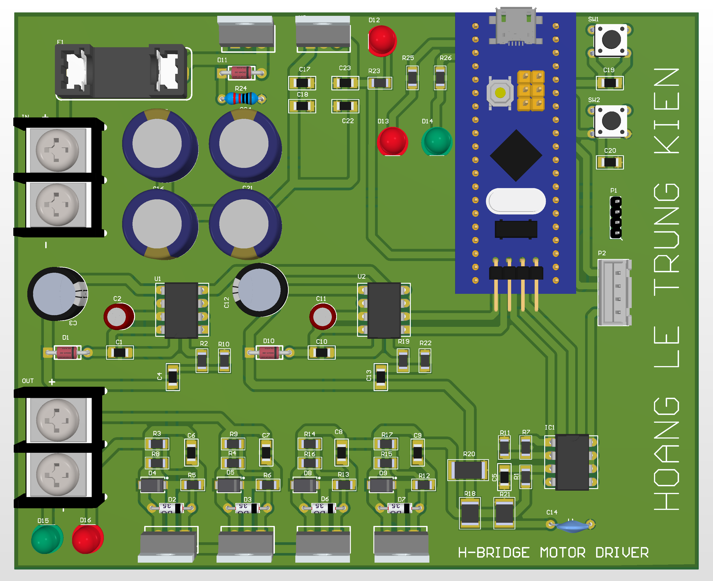

# Discrete H-Bridge Motor Driver

High-power discrete motor driver.

## Function
Motor control with embedded MCU logic.

## Key Specifications
- MCU: STM32F103 (Bluepill)
- Driver: IR2184
- MOSFETs: IRF4905 / HY3210
- Feature: Current feedback

## Hardware Preview

---
Designed by HOANG LE TRUNG KIEN
